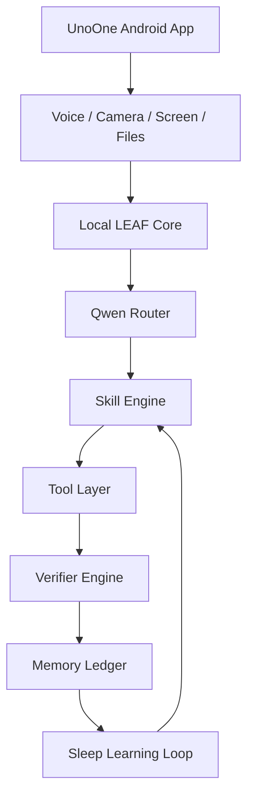

# Building UnoOne LEAF: India's Local AGI Fabric

Imagine an AI that truly understands your world, not just a cloud server thousands of kilometres away. That's the vision driving UnoOne LEAF, our new direction for building a Local Evolving Agent Fabric right here at InBharat. We're not just chasing the global AGI dream; we're building it for India, starting with your pocket.

## The Problem: AI That Doesn't Understand Bharat

Most AI today lives in massive data centres, far removed from the daily realities of an Indian user. It struggles with regional languages, slow 4G networks, and the diverse data formats we encounter – from handwritten Sahayaak Seva forms in a remote clinic to a student's resume in a Tier-2 city. Cloud-dependent AI often means latency, high data costs, and a lack of true privacy. We need an AI that's always on, always learning, and always local.

My team in Chennai spent months seeing how existing models faltered with nuanced Indian contexts. A simple document extraction task, for instance, often needed extensive re-engineering for local dialects or specific government form layouts. This isn't just about translation; it's about cultural and contextual understanding.

## Our Framework: UnoOne LEAF – Local Evolving Agent Fabric

UnoOne LEAF is designed as a local-first agent operating system. It's built to analyze any data on your device, act through tools, verify its own results, remember its failures, and continuously improve its skills over time. Think of it as a personal, evolving intelligence living directly on your phone or local device.

Here's how we're structuring it:

At its heart, the `Local LEAF Core` orchestrates everything. The `Qwen Router` acts as the brain, directing tasks to the right `Skill Engine`. Our `Tool Layer` allows the agent to interact with the device and external services, much like a human uses different apps. Crucially, the `Verifier Engine` checks the agent's work, and the `Memory Ledger` records every success and failure. This feedback loop, powered by the `Sleep Learning Loop`, is how LEAF gets smarter every night, without needing constant cloud updates.

We're starting with a `Qwen-first` model plan, leveraging smaller, efficient models like `qwen2.5:1.5b` for tasks like intent routing and JSON planning, and `qwen2.5-coder:1.5b-instruct` for code generation and tool repair. This allows us to keep the intelligence local and nimble, even on mid-range Android devices common across India.

## India Deployment Reality: Offline, Low-Cost, Local

Building for India means designing for constraints that become strengths. Our focus on local models means less reliance on constant internet connectivity, crucial for users in areas with patchy 4G or limited data plans. This offline-first approach significantly cuts data costs (in ₹) and ensures privacy, as sensitive data never leaves the device.

The architecture is modular. The Android app, already familiar to UnoOne users, acts as the user-facing agent. It communicates with the `leaf-core`, which can run locally on the device or even a nearby low-power server. This flexibility is key for deploying across diverse environments, from a farmer's smartphone to a small business's local server.

Our initial feature, the **Any Data Analyzer**, is designed to handle the messy, unstructured data prevalent in India – PDFs, text, screenshots, CSVs, even app logs. It will extract key entities, identify missing information, and suggest actions, all locally. This is a practical step towards making AI useful for everyday tasks, like processing a Sahayaak Seva health form or analyzing a university profile for UniAssist.

## What This Becomes: A Foundational AI Layer for Bharat

UnoOne LEAF isn't just an upgrade; it's the foundational intelligence layer for multiple InBharat products:

*   **UnoOne:** Enhanced phone control and a truly offline personal assistant.
*   **Sahayaak Seva:** Intelligent health and document extraction, making field work more efficient.
*   **UniAssist:** Smarter profile analysis and visa checklist assistance for students.
*   **KathaKitaab:** Improved story consistency and scene repair for local language content creation.

This local AGI fabric will allow us to deploy intelligent features that are deeply integrated with the user's context, respecting their data and working seamlessly regardless of network conditions. It's about building practical AI that truly serves India's diverse needs.

## FAQ

**Q1: How will UnoOne LEAF handle regional languages and dialects?**
A1: Our local Qwen models are being fine-tuned with diverse Indian language datasets. The `Skill Engine` and `Memory Ledger` are designed to learn and adapt to specific linguistic nuances and cultural contexts over time, improving accuracy for regional languages without relying on a distant cloud service.

**Q2: What kind of devices will UnoOne LEAF run on?**
A2: We are optimizing for mid-range Android smartphones, which are widely accessible in India. By using quantized Qwen models (0.5B / 1.5B) and a modular Python kernel, we aim for efficient performance on devices with 4GB RAM or more, ensuring broad accessibility.

**Q3: How does the "Sleep Learning Loop" work without internet?**
A3: The `Sleep Learning Loop` operates entirely on the local device. It reviews past task failures stored in the `Memory Ledger`, identifies patterns, and then intelligently mutates and tests variations of skill prompts. The best-performing skill variants are then promoted for future use, all without needing external data or cloud connectivity.

## Bottom Line

Building true AGI for India means starting local, embracing constraints, and focusing on practical, on-device intelligence. UnoOne LEAF is our commitment to this vision, creating an evolving, self-improving AI fabric that understands and serves the unique needs of Bharat. Explore more about our practical AI solutions at [InBharat.ai](https://inbharat.ai) or dive into how we're building [AI for Indian Languages](https://inbharat.ai/articles/ai-for-indian-languages) and [optimizing AI for low-resource environments](https://inbharat.ai/articles/optimizing-ai-low-resource).

#InBharatAI #LocalAGI #MadeInIndia #AIForBharat