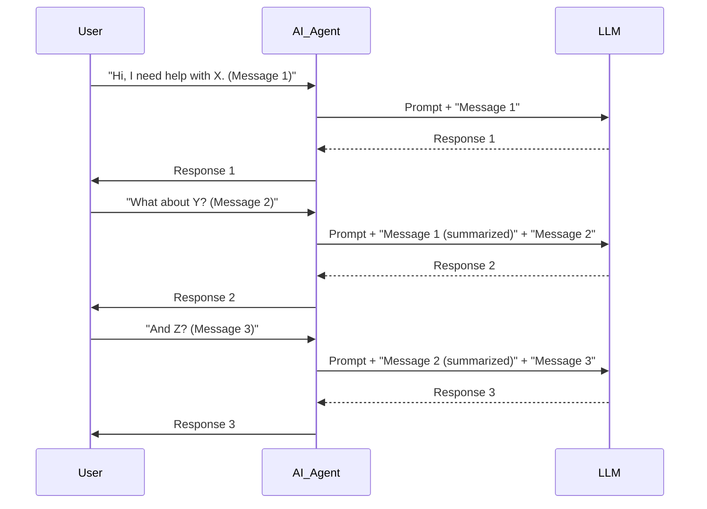

In real-world AI applications in India, especially those dealing with diverse data like medical records or regional language content, simply writing a good prompt is rarely enough. The true challenge lies in **context engineering**: managing everything the LLM "sees" or "knows" when generating a response, including selecting, ordering, and truncating information to fit within token limits and achieve precise outputs.

## Why Context Engineering Matters More Than Ever

When I started building AI agents for specific Indian use cases, like Sahayaak Seva for healthcare field assistance or TestsPrep for exam preparation, I quickly realized that prompt engineering, while important, was just one piece of the puzzle. An LLM's output quality isn't solely dependent on the instruction you give it; it's heavily influenced by the *context* you provide alongside that instruction. This includes documents, prior conversation turns, user profiles, and even system-level metadata.

Think about it: an LLM has a finite "attention span" – its context window. If you feed it irrelevant information, or too much information, its ability to focus on the crucial details diminishes. For us at InBharat AI, operating with cost constraints and often on mid-range devices, efficient use of this context window is not a luxury; it's a necessity. Context engineering is the practice of deliberately designing, structuring, and optimizing this information [1, 2]. It encompasses managing everything the model "sees" or "knows" , going beyond crafting effective prompts .

## The Three Pillars of Context Engineering

Context engineering can be broken down into three core strategies:

1.  **Selection**: What information do you include?
2.  **Ordering**: How do you arrange the information?
3.  **Truncation**: How do you fit it all within the context window?

Let's dive into each with examples relevant to building AI in India.

### 1. Selection: Choosing the Right Information

This is perhaps the most critical step. Feeding an LLM too much irrelevant data is like asking a student to find a specific answer in a textbook without telling them which chapter to look in. They'll spend more time sifting through noise than finding the signal.

For Sahayaak Seva, our healthcare assistant, imagine a field worker asking about a patient's medication. We don't just dump the entire patient history into the prompt. Instead, we intelligently select:

*   **Relevant medical history**: Only conditions related to the current query or recent consultations.
*   **Current medication list**: The most up-to-date prescription data.
*   **Standard treatment protocols**: If the query is about dosage, we might include the relevant section from an official medical guideline.

This is where techniques like Retrieval Augmented Generation (RAG) shine. As I've discussed in "RAG: How Indian AI Teams Make LLMs Actually Useful" (https://www.inbharat.ai/learn-ai-with-reeturaj/rag), RAG allows us to retrieve highly relevant snippets from a knowledge base and inject them into the LLM's context. This isn't just about accuracy; it's also about reducing token usage, which directly impacts inference costs – a major consideration in the Indian market.

Consider a scenario where a user in a regional language asks a question. We don't just pass the original query. We might perform an initial semantic search on a knowledge base translated into that regional language, or use a multilingual embedding model to retrieve relevant documents irrespective of their original language.

### 2. Ordering: Structuring for Clarity

The order in which you present information to an LLM can significantly impact its performance. LLMs often exhibit a "recency bias" or "primacy bias," meaning they pay more attention to information at the beginning or end of the context window.

For TestsPrep, our exam preparation tool, if a student asks for a solution to a complex math problem, we might structure the context like this:

1.  **Problem Statement**: Clearly state the question.
2.  **Relevant Formulas/Theorems**: Place the most applicable concepts right after the problem.
3.  **Step-by-step example (if similar)**: A worked-out example of a similar problem, showing the methodology.
4.  **Student's previous attempts/errors**: If available, providing this helps the LLM tailor its explanation to the student's specific misconceptions.

This ordered approach guides the LLM through the thought process, making it more likely to produce a coherent and accurate solution. I've seen improvements in answer quality by optimizing context ordering for specific problem types.

Another common pattern is to place the core instruction or the most critical piece of information at the very beginning or end of the context. Experimentation is key here. What works for a summarization task might not work for a question-answering task.

### 3. Truncation: Managing the Context Window

Every LLM has a maximum context window, measured in tokens. Exceeding this limit means your input gets cut off, leading to incomplete or nonsensical outputs. This is especially challenging when dealing with long documents, extended conversations, or detailed user profiles.

For our scam detection agent, JAK Shield, analyzing a suspicious message chain might involve many turns. If the conversation exceeds the token limit, we need smart truncation strategies:

*   **Summarization**: Use a smaller LLM or a pre-trained summarization model to condense earlier parts of the conversation. This preserves the gist while reducing token count.
*   **Sliding Window**: For very long documents or conversations, process the text in chunks, maintaining a "sliding window" of the most recent and most relevant information. This is common in agentic AI systems, as discussed in "What Agentic AI Really Means — and Why It Matters for India’s Future" (https://www.inbharat.ai/learn-ai-with-reeturaj/agentic-ai).
*   **Prioritization**: If certain parts of the context are more critical (e.g., the user's explicit question vs. pleasantries), prioritize keeping those parts intact during truncation.

Here’s a simplified illustration of how a sliding window might work for a conversation:

In this diagram, as the conversation progresses, older messages are either summarized or dropped to keep the total context within the LLM's window, ensuring the most recent and relevant parts are always considered.

## Context Engineering in Practice: The Indian Reality

Building for Bharat means facing unique challenges that make context engineering even more critical:

*   **Multilingualism**: India's linguistic diversity means an AI application might need to handle inputs and generate outputs in Hindi, Marathi, Tamil, Bengali, and more. Context engineering here involves ensuring that selected documents are language-appropriate or that multilingual embeddings are used effectively.
*   **Data Scarcity**: For many niche Indian domains (e.g., specific regional agricultural practices), high-quality, structured data might be scarce. This forces us to be extremely precise in selecting the few relevant pieces of context we do have.
*   **Cost Sensitivity**: Every token sent to an LLM costs money. Efficient context engineering directly translates to lower operational costs, making AI solutions more viable for Indian SMBs.
*   **Network Latency**: On 4G networks, minimizing the size of the context window can reduce the data transfer overhead, leading to faster response times for users in rural or semi-urban areas.

This is why a "prompt engineer" at InBharat AI is often more of a "context engineer." They're not just writing instructions; they're designing entire data flows that feed the LLM. This skill is becoming as crucial as traditional software development, as I hinted at in "Prompt Engineering Is a Real Skill — and Indian Developers Who Master It Will Win" (https://www.inbharat.ai/learn-ai-with-reeturaj/prompt-engineering).

## Bottom Line

Context engineering is the unsung hero behind robust, cost-effective AI applications. It's the deliberate process of curating and presenting information to an LLM, ensuring it "sees" exactly what it needs to, no more and no less. For Indian builders, mastering selection, ordering, and truncation isn't just about better AI; it's about building AI that truly works for Bharat – efficient, accurate, and mindful of our unique constraints. This is how we move beyond simple chatbots and build truly intelligent agents, as explored in "AI Agents Aren’t Just Chatbots — They’re the Workforce Multiplier India Needs" (https://www.inbharat.ai/learn-ai-with-reeturaj/what-are-ai-agents).

---
Reeturaj
#AI #ContextEngineering #LLMs #InBharatAI #IndianTech